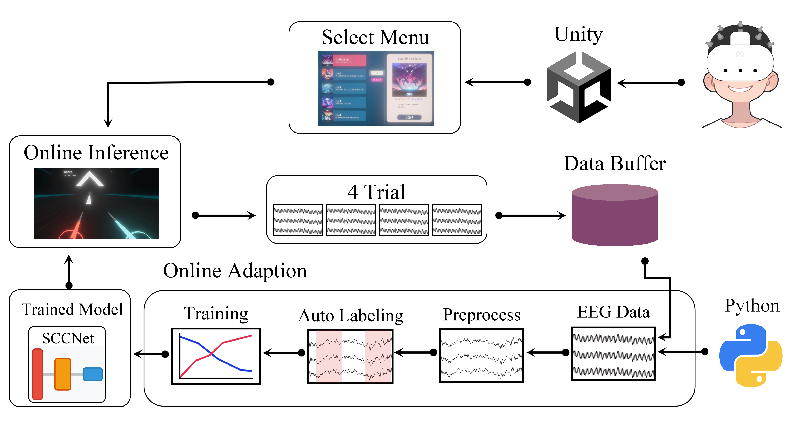
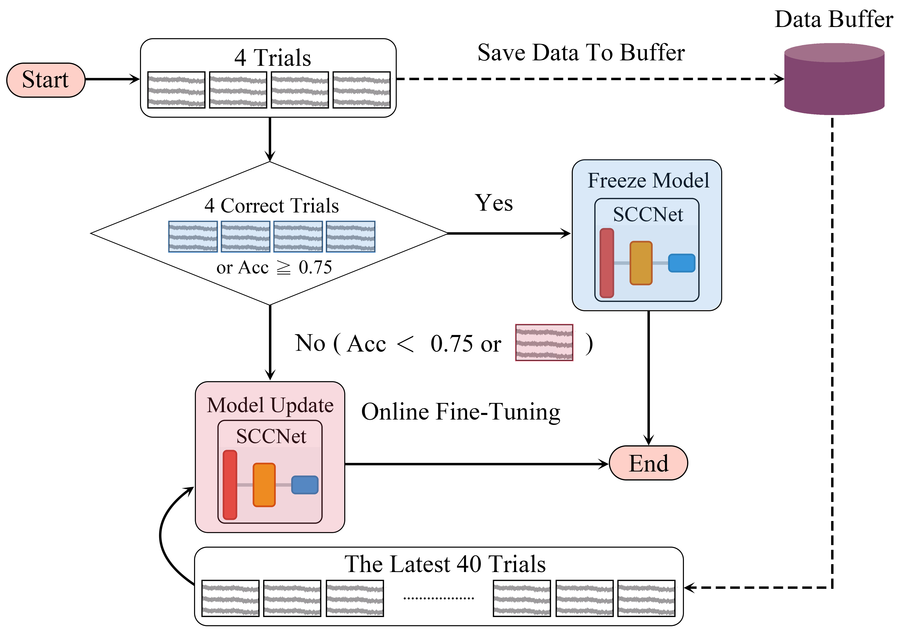

# VR_BCI



啟動步驟: Python 執行 `python/main/main_start.py`，unity 再執行程式碼。

現在有新增 v1.0 release 的版本，不需要 VR heatset，直接下載就連接腦波帽就可以測試。

==python 測試 config 需要把 `is_simulated_eeg` 調成 `False`==

# 環境安裝

## unity

安裝版本: 2022.3.622，需要下載 android 版本的內容

unity 直接把 unity 資料夾放入到 unity 就可以開啟，最初開始要等一段時間

實際會用到的場景只有: Lobby (進入點), EEG_Calibration (用於 calibration), MI (腦波遊玩), BeatSaber (這個單純是 BeatSaber)

## Python

建議使用 anaconda 創建一個新的環境，然後再下載對應內容

python 版本: 3.11.8

requirement 在 python 資料夾下面

```
pip install -r requirements.txt
```

torch install，==注意 torch 需要根據自己的需求下載==，每個人指令會根據電腦設備不一樣

```
pip install --force-reinstall torch==2.3.0 torchvision==0.18.0 torchaudio==2.3.0 xformers==0.0.26.post1 --index-url https://download.pytorch.org/whl/cu121
```

下載完成後需要測試可不可以用 GPU

```python
import torch
torch.cuda.is_available()
```


# 運行流程圖示

4 個 Trial update 一次，進行 online update




# 程式碼說明

## unity

基本上都放在 `unity\Assets\Script`，~~刪除縣~~的 scirpt 不用管，不是沒用到就是廢棄，而**重點**的部分，就是比較會改到的 script

* Audio
  * AudioManager.cs: 音效處裡 script，透過設定在一個 obj 上面，然後播放各種音效，這個音效一次觸發一個
  * text2speech.cs : 教學模式會用到，其他地方沒用，需要連網路才能用，使用 speak 會講出對應英文，不能說中文。
  * ~~TtsClient.cs~~ : 中文 TTS 會用到，目前暫時沒用
* BeatSaber
  * Effect
    * AudioEmissionController.cs: 根據音樂的大小，讓光線變化 (長條 line 特效)
    * **AutoSaber.cs**: 自動揮砍的判斷，可以設定揮動速度，和延遲幾秒後揮動，這部分需要根據情況微調
    * KeyboardEffect.cs: 光劍碰到地板會有敲琴鍵的特效
    * ~~LongNote.cs~~: 沒用
    * ObjectLinePlacer.cs: 之前用於一次產生多個 note (藍或是紅) 到一個 long note (白色) 上面，現在只有在 calibration 會用到
  * Slicer
    * ~~CubeSlicer.cs~~: 根據 [EzySlice](https://github.com/DavidArayan/ezy-slice) 套件提供的功能，用於測試切砍的程式碼
    * **SaberSlicer.cs**: 實際切砍程式碼，**這邊有送出 flag 的作用**，會送出 CUT 的 flag 到 python
  * SongMapProcess
    * BeatmapData.cs: 定義地圖的內容 結構化的 class
    * **BeatmapSpawner.cs**: 生成 note 的程式碼
    * **BeatSaberInfoLoader.cs**: 讀取基礎資訊，像是 BPM  之類的，和地圖資訊，之後再由 BeatmapSpawner.cs 處裡，兩個 script 黏合性高，這個 script 決定歌曲開始的時間，開始會有延遲，會對應到 forward.cs 裡面動畫時間。
    * CalibrationBeatmapSpawner.cs: 繼承 BeatmapSpawner.cs，針對 calibration 進行設計，不讀取 map，而是人工發送 (**目前版本這個已經沒有使用**，把 Calibration 變成與 Run 一樣 (使用 BeatmapSpawner，不過多了發送 update model 的指令到 python 那邊，然後 python update)
    * SongInfo.cs: 定義歌曲內容，像是圖片，BPM，歌曲名稱 ... 結構化的 class
  * **forward.cs**: 主要 note (音符) 向前的邏輯，裡面 speed 是裝飾，主要要調動畫的長度，因為目前是設定終點，然後在固定時間內到終點
  * ~~PerpendicularVector.cs~~: 沒用
  * ~~RotateTransforms.cs~~: 沒用
* ~~EEG~~
  * ~~AutoFistWithOVR.cs~~: 偵測使用者握拳，測試用。沒用
  * ~~EEGTrain.cs~~: 傳統訓練會用到，用於 EEG_v2
  * ~~HandFistChecker.cs~~: 偵測使用者握拳。沒用
* FadeEffect: 裡面只有材質有用
  * ~~FadeEffect.cs: 沒用~~
  * ~~HeadCollisionDetector.cs~~: 沒用
  * ~~HeadCollisionHandler.cs~~: 沒用
* FileProcess
  * **NoteLogTrigger.cs**: 放在 long note 上面，會觸發 start 和 end 的 log，發送給 python，標註 Label
  * TimeLogger.cs: 用於紀錄 LOG 到本地端
* ~~Hand~~: 沒用到
* ~~LCK~~: 用於錄影的功能，不會用到
* Lobby
  * FadeScreen.cs:  裡面放過場特效，螢幕黑，貼在玩家眼前
  * SceneTransitionManager.cs: 過場切換，時間控制
  * SetOptionFromUI.cs: 設定 option 的 UI 控制 (音量)，目前還沒有相關設定
  * Song_UI_shower.cs: 設定 UI，並顯示對應歌曲，這個會有多個，每個 script 對應一首歌曲，裡面放入對應的 SO
  * SongSelectMenu.cs: 這個只有一個，並且會記錄玩家選擇的歌曲狀況，透過 Song_UI_shower.cs 裡面的 song，可以存內容到 json 裡面，然後到 MI 場景就可以透過 json load 對應歌曲難度以及是什麼歌。與 Song_UI_shower.cs 黏合性高
  * UIAudio.cs: 直接播放音源，用於按鈕的觸發控制
* ~~LSL~~: 之前的傳輸方式，現在不會用到
* Manager
  * GameDataManager.cs: 場景切換，這個 script 還會在，紀錄需要固定的資料，目前只有存放有哪些模型 (可以提供玩家選擇)
  * GameManager.cs: 紀錄遊戲中各種 event，並有註解是在那裡觸發，以及是在那裡加入，裡面還會記錄遊戲中一些動態資料像是分數
  * SceneLoaderManager.cs: 可以觸發場景切換的 script
  * ScoreManager.cs: 紀錄分數
* SO: Scriptable Object，創建 SO，有點像是創建一個 data 紀錄器，然後可以根據不同 data 進行挪用
  * Song.cs: 歌曲的 SO
  * SongEditor.cs: Song.cs SO 編輯器，會根據使用者輸入對應內容 real time 寫入 SO 內容
* Static
  * Config.cs: 儲存設定檔案，像是連線 IP 位置、group 設定多少、傳輸使用字串 ... 紀錄不會動的變量
  * StreamingAssetLoader.cs: 讀取歌曲的時候會用到的 static library
  * ~~WAVUtility.cs~~: 目前沒用到，如果後續有寫 LLM TTS chinese server 才會使用
* TCP
  * TCP_Client.cs: 負責處裡 python 的傳輸
* UI : UI 互動，蠻多地方會加入 event 的，讓 程式碼 呼叫功能的時候， UI 可以做對應更動
  * DebugUI.cs
  * GameStartMenu.cs
  * OptionMenu.cs
  * SelectModelButtonUI.cs
  * SelectModelUI.cs
  * TrainingLogUI.cs
  * TutorialContinueUI.cs

## Python

==再次提醒: Config.py 裡面 is_simulated_eeg，目前為 false，如果要使用腦波帽，請調成 true==

執行程式碼，會根據 unity 那邊選取歌曲，把使用者資料存入到 real_time_data 下面，會根據 run 儲存 csv (data) 與 txt (label)，儲存的 pt 為 calibration 加入到 buffer 裡面的 data。

程式碼執行的時候，在訓練完成模型會拿取 loss 最低的，然後放入到 `EEG\checkpoint_main` 下面，存成 `c_xxx` 的形式。

主要在 `main` 下面


* EEG
* real_time_data
  * checkpoint_main: 放主要使用模型的資料夾 (會出現在模型選擇裡面)
  * checkpoints: 放訓練模型的資料夾 (100 epoch 會有 100 個模型)
  * CygnusEEGReader.py: cygnus 資料處裡
  * data_process_np.py: 讀取 log 轉成 np
  * EEG_Train.py: np 轉 tensor，並重新 label，然後設定要的參數然後準備訓練
  * EEGPrediction.py: EEG 預測，根據 eeg buffer 餵給模型，然後給出 prediction，然後傳送到 unity
  * MI_train.py: 主要訓練程式碼
* Utils
  * **config.py**: 紀錄不會動的變量，和 Unity Config.cs 有對應
  * **global_value.py**: 紀錄會動的 global 變量，像是現在有的模型名稱，現在模型存檔有幾個，eeg buffer，現在使用的模型名稱 ...
  * LSL.py: 用於與腦波帽傳輸
  * preprocess.py: 資料前處裡 bandpass filter ...
  * some_functions.py: 一些雜 function，目前有兩個，一個為資料字串加上時間 (re string)，另一個為看目前資料夾下面有沒有一樣的文件，如果有就重新命名
  * TCPServer.py: 建立 TCP Server，並可以 broadcast 給 client
  * **UnityMarkerReader.py**: 接收 unity 傳來的東西，並回應，或是做對應處裡
  * file_pointer_reader.py: 紀錄文件讀取點，在 calibration 不需要重新讀取 CSV，加速運算處裡
* game_state.py: state machine，用於各個 state 的切換
* **main_start.py**: 程式碼開始點

tools 為新增歌曲會用到，與 create_MInp.py 為把 CSV 與 TXT 轉換成 numpy 取出 MI 資料的檔案


## noVR

沒有 VR 版本的 Unity，有放 release 版本提供下載

主要刪除 meta quest 的大多功能，只有保留 voice SDK，其他全部刪除，script 把不需要的基本都刪除了

移除內容: 移除 script `OVR`、`Oculus`、`OVRSimpleJSON` using 的功能

Task: 移除 Meta Quest 相關內容

> 刪除 Meta SDK 資料夾

- 刪除 `Assets/MetaXR/`
- 刪除 `Assets/Oculus/`
- 刪除 `Assets/Samples/Meta - Voice SDK - Immersive Voice Commands/`
- 刪除 `Assets/Samples/Meta XR Interaction SDK/`
- 刪除 `Assets/XR/`
- 刪除 `Assets/Plugins/Android/`

> 修改 script

- 清空 `Script/Hand/ControlOVRHand.cs`
- 清空 `Script/EEG/HandFistChecker.cs`
- 移除 `Script/BeatSaber/Effect/AutoSaber.cs` 的 Oculus using
- 移除 `Script/BeatSaber/SongMapProcess/BeatSaberInfoLoader.cs` 的 Meta/OVR using
- 移除 `Script/Lobby/Song_UI_shower.cs` 的 Meta/OVR using
- 移除 `Script/LSL/LSLVisualizer.cs` 的 Oculus using
- 移除 `Script/TCP/TCP_Client.cs` 的 Oculus using

> 其他細節處裡

* SongSelectMenu 把 BeatSaber 模式移除，然後把許多 UI 刪除，並變成使用觸控模式
* SceneLoaderManager 把轉移場景部分註解 (BeatSaberStage, CalibrationStage (因為後來統一 Calibration 在 MI))
* 把 GM 裡面 VR 手自動關掉的 event auto saber 相關內容刪除 (對應 invoke 也移除)
* 加入 eventsystem 和 UI 改成 canvas 然後是貼螢幕的不是 global
* transition animator 把它變成放在 UI 前面，使用 UI 物件，把 transition 的 canvas sort order 調成 1 (原本 0)。
* 加入 esc 可以暫停的功能 (MI 遊戲中)
* 讓遊戲可以在背景也繼續 run，不會因為切到 python 就被打斷
* final canvas 和 option 都改 UI
* 刪除到只剩下必要的兩個 scene

有些部分 meta 的 script 還有殘留在 scene 上面，所以會跑出 warining (約 180 個)，這部分以後慢慢移除

<iframe width="420" height="345" src="https://stereomp3.github.io/VR_BCI_Video/20260502/noVR_test.mp4" allowfullscreen >
        </iframe>

# 其他

> 新增歌曲

如果需要新增加歌曲，可以到 https://beatsaver.com/ 下載 map，然後使用 `python/dat_process.py` 把歌曲變成 unity 可以讀取的形式，如果歌曲版本太新，unity 無法讀取，可以使用 `python/map3to2.py` ，把歌曲 json 格式稍微更改，然後再放入 unity，unity 歌曲主要放入到 `unity/Assets/StreamingAssets`，然後在 `unity/Assets/SO/Songs` 有紀錄各檔案的位置資訊，在 lobby UI `Song Select UI>CanvasRoot>UIBackplate+VerticalLayoutGroup>Horizontal>SongsL>Viewport>Content` 下面把新的歌曲放入，然後加入對應的 Scriptable Object (SO) 就可以在畫面上看到新的歌曲


