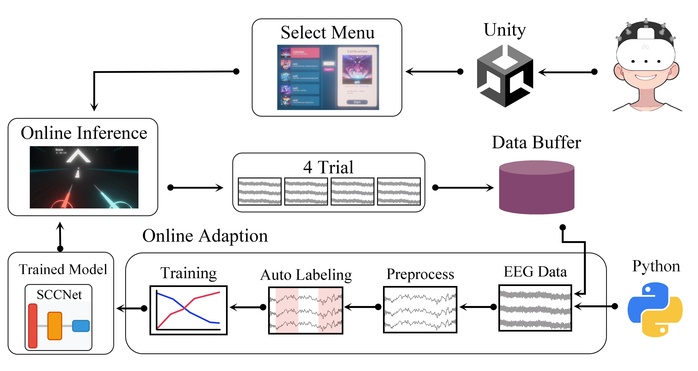
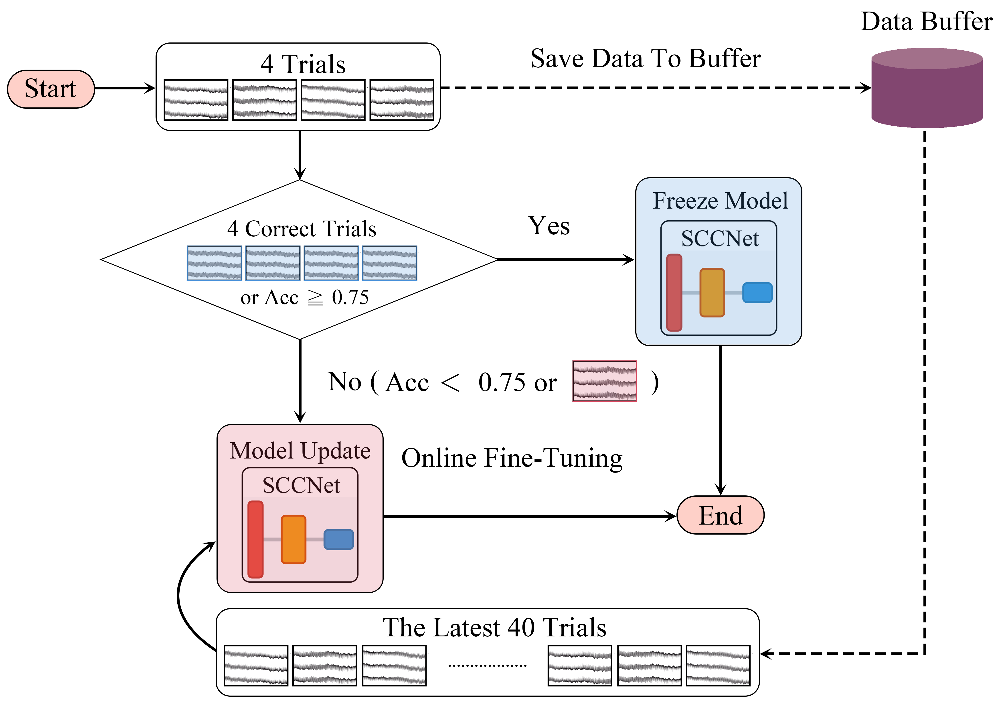
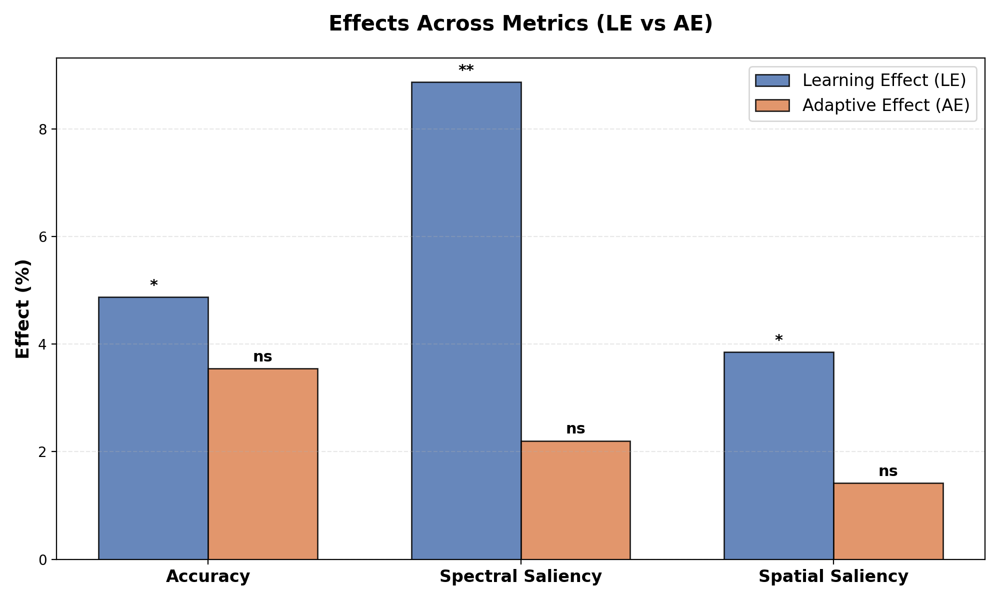
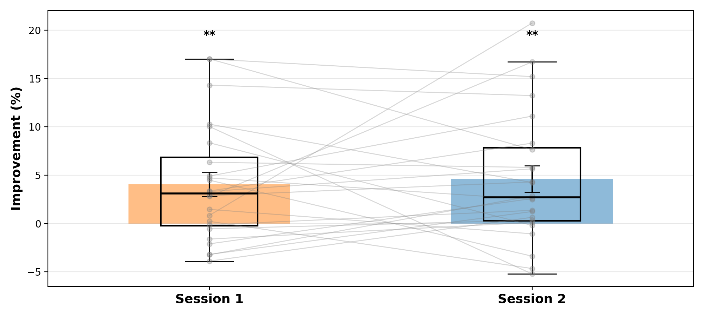
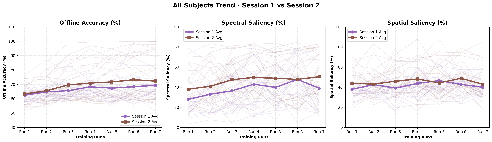
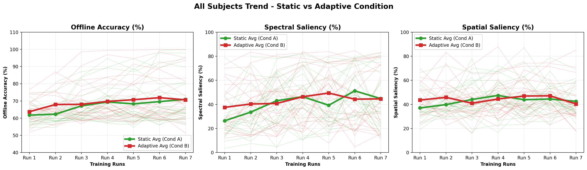
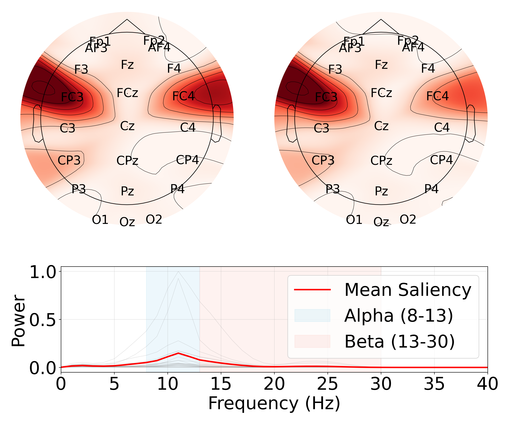

# VR_BCI

交接文件: https://hackmd.io/@cecnlCECNL/SkbdNyUmfe



啟動步驟: Python 執行 `python/main/main_start.py`，unity 再執行程式碼。

現在有新增 v1.0 release 的版本，不需要 VR heatset，直接下載就連接腦波帽就可以測試。

==python 測試 config 需要把 `is_simulated_eeg` 調成 `False`==

# 環境安裝

## unity

安裝版本: 2022.3.622，需要下載 android 版本的內容

unity 直接把 unity 資料夾放入到 unity 就可以開啟，最初開始要等一段時間

實際會用到的場景只有: Lobby (進入點), EEG_Calibration (用於 calibration), MI (腦波遊玩), BeatSaber (這個單純是 BeatSaber)

## Python

建議使用 anaconda 創建一個新的環境，然後再下載對應內容

python 版本: 3.11.8

requirement 在 python 資料夾下面

```
python/conda create --name <env> python/requirements.txt
```

torch install，==注意 torch 需要根據自己的需求下載==，每個人指令會根據電腦設備不一樣

```
pip install --force-reinstall torch==2.3.0 torchvision==0.18.0 torchaudio==2.3.0 xformers==0.0.26.post1 --index-url https://download.pytorch.org/whl/cu121
```

下載完成後，可直接執行專屬環境檢測腳本，一鍵檢查 GPU 加速、CUDA 及所有核心依賴套件（MNE, Captum, Braindecode, PyLSL, XBrainLab 等）：

```bash
python python/check_env.py
```

## 設定檔單一來源 (Single Source of Truth)

專案已整合統一設定檔 `python/config.json`（與 `unity/Assets/StreamingAssets/config.json` 同步）：
- **通道設定切換**：直接修改 `active_channels` 為 `8`, `13`, `22` 或 `32`，Python 端與 Unity 端將同步切換對應的通道 index 與網路參數。
- **TCP 與遊戲設定**：集中設定 TCP Port (預設 `50007`)、IP、`trial_train_interval`、`group_note_num` 等。
- **模擬模式切換**：無實體腦波帽時，可將 `"is_simulated_eeg"` 設為 `true`。

```json
{
  "active_channels": 32,
  "channel_definitions": {
    "8": [2, 3, 4, 5, 6, 7, 8, 9],
    "13": [7, 8, 9, 12, 13, 14, 17, 18, 19, 22, 23, 24, 28],
    "22": [2, 3, 4, 5, 7, 8, 9, 12, 13, 14, 17, 18, 19, 22, 23, 24, 27, 28, 29, 31, 32, 33],
    "32": [2, 3, 4, 5, 6, 7, 8, 9, 10, 11, 12, 13, 14, 15, 16, 17, 18, 19, 20, 21, 22, 23, 24, 25, 26, 27, 28, 29, 30, 31, 32, 33]
  },
  "tcp_network": {
    "host": "127.0.0.1",
    "port": 50007
  }
}
```


# 運行流程圖示

4 個 Trial update 一次，進行 online update




# 程式碼說明

## unity

基本上都放在 `unity\Assets\Script`，~~刪除縣~~的 scirpt 不用管，不是沒用到就是廢棄，而**重點**的部分，就是比較會改到的 script

* Audio
  * AudioManager.cs: 音效處裡 script，透過設定在一個 obj 上面，然後播放各種音效，這個音效一次觸發一個
  * text2speech.cs : 教學模式會用到，其他地方沒用，需要連網路才能用，使用 speak 會講出對應英文，不能說中文。
  * ~~TtsClient.cs~~ : 中文 TTS 會用到，目前暫時沒用
* BeatSaber
  * Effect
    * AudioEmissionController.cs: 根據音樂的大小，讓光線變化 (長條 line 特效)
    * **AutoSaber.cs**: 自動揮砍的判斷，可以設定揮動速度，和延遲幾秒後揮動，這部分需要根據情況微調
    * KeyboardEffect.cs: 光劍碰到地板會有敲琴鍵的特效
    * ~~LongNote.cs~~: 沒用
    * ObjectLinePlacer.cs: 之前用於一次產生多個 note (藍或是紅) 到一個 long note (白色) 上面，現在只有在 calibration 會用到
  * Slicer
    * ~~CubeSlicer.cs~~: 根據 [EzySlice](https://github.com/DavidArayan/ezy-slice) 套件提供的功能，用於測試切砍的程式碼
    * **SaberSlicer.cs**: 實際切砍程式碼，**這邊有送出 flag 的作用**，會送出 CUT 的 flag 到 python
  * SongMapProcess
    * BeatmapData.cs: 定義地圖的內容 結構化的 class
    * **BeatmapSpawner.cs**: 生成 note 的程式碼
    * **BeatSaberInfoLoader.cs**: 讀取基礎資訊，像是 BPM  之類的，和地圖資訊，之後再由 BeatmapSpawner.cs 處裡，兩個 script 黏合性高，這個 script 決定歌曲開始的時間，開始會有延遲，會對應到 forward.cs 裡面動畫時間。
    * CalibrationBeatmapSpawner.cs: 繼承 BeatmapSpawner.cs，針對 calibration 進行設計，不讀取 map，而是人工發送 (**目前版本這個已經沒有使用**，把 Calibration 變成與 Run 一樣 (使用 BeatmapSpawner，不過多了發送 update model 的指令到 python 那邊，然後 python update)
    * SongInfo.cs: 定義歌曲內容，像是圖片，BPM，歌曲名稱 ... 結構化的 class
  * **forward.cs**: 主要 note (音符) 向前的邏輯，裡面 speed 是裝飾，主要要調動畫的長度，因為目前是設定終點，然後在固定時間內到終點
  * ~~PerpendicularVector.cs~~: 沒用
  * ~~RotateTransforms.cs~~: 沒用
* ~~EEG~~
  * ~~AutoFistWithOVR.cs~~: 偵測使用者握拳，測試用。沒用
  * ~~EEGTrain.cs~~: 傳統訓練會用到，用於 EEG_v2
  * ~~HandFistChecker.cs~~: 偵測使用者握拳。沒用
* FadeEffect: 裡面只有材質有用
  * ~~FadeEffect.cs: 沒用~~
  * ~~HeadCollisionDetector.cs~~: 沒用
  * ~~HeadCollisionHandler.cs~~: 沒用
* FileProcess
  * **NoteLogTrigger.cs**: 放在 long note 上面，會觸發 start 和 end 的 log，發送給 python，標註 Label
  * TimeLogger.cs: 用於紀錄 LOG 到本地端
* ~~Hand~~: 沒用到
* ~~LCK~~: 用於錄影的功能，不會用到
* Lobby
  * FadeScreen.cs:  裡面放過場特效，螢幕黑，貼在玩家眼前
  * SceneTransitionManager.cs: 過場切換，時間控制
  * SetOptionFromUI.cs: 設定 option 的 UI 控制 (音量)，目前還沒有相關設定
  * Song_UI_shower.cs: 設定 UI，並顯示對應歌曲，這個會有多個，每個 script 對應一首歌曲，裡面放入對應的 SO
  * SongSelectMenu.cs: 這個只有一個，並且會記錄玩家選擇的歌曲狀況，透過 Song_UI_shower.cs 裡面的 song，可以存內容到 json 裡面，然後到 MI 場景就可以透過 json load 對應歌曲難度以及是什麼歌。與 Song_UI_shower.cs 黏合性高
  * UIAudio.cs: 直接播放音源，用於按鈕的觸發控制
* ~~LSL~~: 之前的傳輸方式，現在不會用到
* Manager
  * GameDataManager.cs: 場景切換，這個 script 還會在，紀錄需要固定的資料，目前只有存放有哪些模型 (可以提供玩家選擇)
  * GameManager.cs: 紀錄遊戲中各種 event，並有註解是在那裡觸發，以及是在那裡加入，裡面還會記錄遊戲中一些動態資料像是分數
  * SceneLoaderManager.cs: 可以觸發場景切換的 script
  * ScoreManager.cs: 紀錄分數
* SO: Scriptable Object，創建 SO，有點像是創建一個 data 紀錄器，然後可以根據不同 data 進行挪用
  * Song.cs: 歌曲的 SO
  * SongEditor.cs: Song.cs SO 編輯器，會根據使用者輸入對應內容 real time 寫入 SO 內容
* Static
  * Config.cs: 儲存設定檔案，像是連線 IP 位置、group 設定多少、傳輸使用字串 ... 紀錄不會動的變量
  * StreamingAssetLoader.cs: 讀取歌曲的時候會用到的 static library
  * ~~WAVUtility.cs~~: 目前沒用到，如果後續有寫 LLM TTS chinese server 才會使用
* TCP
  * TCP_Client.cs: 負責處裡 python 的傳輸
* UI : UI 互動，蠻多地方會加入 event 的，讓 程式碼 呼叫功能的時候， UI 可以做對應更動
  * DebugUI.cs
  * GameStartMenu.cs
  * OptionMenu.cs
  * SelectModelButtonUI.cs
  * SelectModelUI.cs
  * TrainingLogUI.cs
  * TutorialContinueUI.cs

## Python

==提示: 可直接於 `python/config.json` 統一修改 `is_simulated_eeg`（預設 `false`，無腦波帽時可設為 `true`），若連線失敗系統亦會自動啟動友善模擬回退保護。==

執行程式碼，會根據 unity 那邊選取歌曲，把使用者資料存入到 `real_time_data` 下面，會根據 run 儲存 csv (data) 與 txt (label)，儲存的 pt 為 calibration 加入到 buffer 裡面的 data。

程式碼執行的時候，在訓練完成模型會拿取 loss 最低的，然後放入到 `EEG/checkpoint_main` 下面，存成 `c_xxx` 的形式。

### 1. 快速測試工具集 (`python/tools/`)

專案提供兩個獨立快速測試工具，供開發者快速驗證訊號串流或個別模型：

- **線上即時 LSL 串流與 Unity 快速測試** (`python/tools/online_test_lsl_to_unity.py`)：
  可在不啟動完整遊戲狀態機的情況下，單獨驗證腦波帽訊號讀取、濾波、模型推論至發送 LSL Marker 給 Unity：
  ```bash
  # 模擬訊號模式 (無實體腦波帽時)
  python python/tools/online_test_lsl_to_unity.py --simulated --channels 22 --model SCCNet

  # 連接實體 Cygnus 腦波帽模式
  python python/tools/online_test_lsl_to_unity.py --channels 32
  ```

- **單檔快速模型訓練與驗證** (`python/tools/quick_trainer.py`)：
  快速測試特定受試者的 `.pt` 檔案，或使用合成 Demo 資料快速驗證模型訓練收斂性：
  ```bash
  # 使用 Demo 平衡資料快速驗證訓練流程
  python python/tools/quick_trainer.py --demo --channels 22 --model SCCNet --epochs 20

  # 指定具體 .pt 資料檔案訓練
  python python/tools/quick_trainer.py --pt_files path/to/run1/data.pt path/to/run2/data.pt --channels 13 --epochs 50
  ```

### 2. 隨機模型初始化與通道不匹配 (Size Mismatch) 自動修復

當在 `config.json` 切換通道數（例如從 32 改為 13 或 22 通道）時，預設權重可能會產生維度衝突。本專案具備**雙重保護機制**：
- **自動修復機制**：即時預測 (`EEGPrediction.py`) 與線上微調 (`MI_train.py`) 在載入 Checkpoint 時若偵測到維度不匹配，系統會**自動捕捉異常並即時生成符合當前通道數的隨機初始權重覆蓋儲存**，保證遊戲不中斷閃退。
- **手動隨機模型產生工具** (`python/main/EEG/generate_random_models.py`)：
  可隨時手動為所有架構（`SCCNet`, `ShallowFBCSPNet`, `EEGNetv4`, `EEGConformer`, `ATCNet`）產生隨機權重：
  ```bash
  # 為指定通道 (如 22 通道) 產生隨機模型
  python python/main/EEG/generate_random_models.py --channels 22

  # 一鍵為 8, 13, 22, 32 全數產生隨機模型
  python python/main/EEG/generate_random_models.py --all_channels
  ```

---

### 3. 主系統模組說明 (`python/main`)

* `main_start.py`: 系統啟動主入口 (啟動 TCP 伺服器與遊戲狀態機)
* `game_state.py`: 遊戲狀態機 (管理 Lobby, Calibration, MI, BeatSaber, Training 狀態切換)
* `EEG/`
  * `checkpoint_main/`: 放主要模型資料夾 (出現在 Lobby 模型選擇清單中，包含 `c_000.pth`, `model.pth`)
  * `checkpoints/`: 訓練暫存模型資料夾 (儲存各 Epoch 模型權重)
  * `CygnusEEGReader.py`: Cygnus 腦波資料讀取與 buffer 管理 (具備友善離線自動回退模擬)
  * `EEGPrediction.py`: 即時腦波特徵推論與 Unity Marker 發送 (具備維度 mismatch 自動隨機權重修復)
  * `EEG_Train.py`: 線上自適應訓練排程、Replay Buffer 管理與 FT Pipeline
  * `MI_train.py`: 線上模型微調與訓練器核心
  * `data_process_np.py`: 讀取 CSV / Log 並提取為 Numpy 腦波 Epoch
  * `models.py`: 定義 SCCNet 等客製模型架構
  * `generate_random_models.py`: 隨機模型初始化與維度修復工具
* `Utils/`
  * `config.py`: 集中讀取 `config.json`，管理所有網路、通道與演算法常數
  * `global_value.py`: 跨執行緒動態共用狀態 (目前模型名稱、執行緒 Lock、Replay Buffer 等)
  * `TCPServer.py`: 高可靠性 TCP 伺服器，負責與 Unity 雙向傳遞狀態與控制字串
  * `UnityMarkerReader.py`: 解析 Unity 傳送之事件 Marker 與狀態切換
  * `file_pointer_reader.py`: 指標式增量 CSV/Log 讀取器 (避免 Calibration 重複讀取檔案，大幅加速)
  * `preprocess.py`: 帶通濾波、去均值與特徵前處理
  * `some_functions.py`: 檔案命名與版本號自動遞增工具


> 在 `python/else` 資料夾的部分（離線分析、模型訓練與特徵管線）

```text
python/else/
├── pipeline.py                      # 【一鍵全自動總管主程式】(整合前處理、訓練、統計出圖與受試者分群)
├── metrics_summary.csv              # 【指標資料庫】(儲存 24 位受試者跨 Session 與 Run 的完整特徵數據)
├── charts/                          # 【成果圖表目錄】(自動輸出所有長條圖、箱型圖、趨勢圖與 WSI 分析圖)
│
├── preprocessing/                   # 【1. 資料前處理】
│   └── create_MInp.py               # 將受試者原始 EEG CSV 與 Log 檔轉換為 MI / Resting 的 .pt 檔案
│
├── training/                        # 【2. 模型訓練與交叉驗證】
│   ├── Models.py                    # 模型架構定義 (SimpleEEGNet, SCCNet 等)
│   ├── MI_train.py                  # 訓練與微調引擎 (BraindecodeTrainerCV 等)
│   ├── train_cv.py                  # 交叉驗證訓練核心與 Saliency 特徵生成引擎
│   ├── 4_fold_CV_13.py              # 13 通道單 Run 獨立訓練入口 (產生 record.pkl、epochs.pkl)
│   ├── 4_fold_CV_13_all.py          # 13 通道全 Session 合併訓練入口
│   ├── 4_fold_CV_22.py              # 22 通道單 Run 獨立訓練入口
│   └── 4_fold_CV_22_all.py          # 22 通道全 Session 合併訓練入口
│
├── analysis/                        # 【3. 指標整合、統計與出圖】
│   ├── analyze_metrics_and_plot.py  # 日誌解析、持久化儲存 CSV、Table 1-3 統計檢定與核心繪圖
│   ├── subject_stratification.py    # 受試者多維度分群篩選與特徵診斷系統
│   ├── compute_saliency_metric.py   # Saliency 指標 (Spectral / Spatial Saliency) 表格生成
│   ├── generate_metric_ttest.py     # Table 1-3 統計檢定與線性混合效應模型 (LMM)
│   ├── generate_metric_plot.py      # 長條圖與箱型圖繪製模組
│   ├── generate_metric_WSI.py       # Within-Session Improvement 專用分析
│   └── generate_metric_sum01.py     # 分群相容轉接外殼 (轉接 subject_stratification.py)
│
├── neuro_analysis/                  # 【4. 神經生理特徵與腦波診斷】
│   ├── TFA2.py                      # BCI 4-Panel 時頻分析 (PSD、Time-domain、Energy) 與特徵自動檢驗
│   ├── erd_topomap_analysis.py      # 全局 ERD 空間地形圖 (Topomap) 與 7 Run 學習演化軌跡
│   └── eyes_movement_detect.py      # 眼動 EOG 作弊檢定與異常波形繪製 (Fp1, Fp2 異常檢出)
│
├── saliency_plot/                   # 【5. Saliency 空間圖與 PSD 綜合視覺化】
│   ├── draw_saliency_topo_PSD.py    # 批次繪製單一受試者 Saliency Topomap 與 PSD 複合圖
│   ├── draw_saliency_topo_PSD_all.py# 將全部受試者合併為 7x24 矩陣大圖
│   └── draw_saliency_topo_PSD_pair.py# 繪製同受試者跨 Session 成對比較圖
│
├── hardware_analysis/               # 【6. 硬體效能與參數優化】
│   ├── find_hardware_performance.py # 解析即時日誌中的推論延遲、TCP 延遲與 FPS
│   ├── plot_hardware_performance.py # 繪製 4 款模型在各 Epoch 下的延遲變化
│   ├── nasa_tlx_charts.py           # 繪製 NASA-TLX 認知負荷問卷分析圖表
│   └── find_best_parameter.py       # 萃取 online_simulation 日誌找出最佳超參數組合
│
├── music_tools/                     # 【7. 歌曲地圖工具】
│   ├── dat_process.py               # 根據間隔過濾刪除多餘 Note
│   └── map3to2.py                   # 歌曲 Map v3 轉 v2 格式相容轉換工具
│
└── utils/                           # 【8. 通用共用工具庫】
    └── common_utils.py              # 常數配置、Tee 日誌、帶通濾波、資料整理與共用統計檢定工具
```

---

### 如何跑完整個 Pipeline 

本系統提供**一鍵主管線 (`pipeline.py`)**，整合了從原始腦波資料處理到產出論文級統計表與圖表的完整生命週期。

#### 1. 一鍵全自動執行
只要一個指令，自動依照順序執行「資料轉換 -> 4-Fold CV 訓練 -> 日誌解析與 CSV 建立 -> 統計檢定與出圖 -> 受試者分群篩選」：

```bash
# 全流程執行
python python/else/pipeline.py --step all --channels 13 --base_dir /mnt/project/MIEXP/DATA_Cygnus --csv_path metrics_summary.csv --plot_dir /path/to/your/file
```

#### 2. Fast Mode from CSV
若已具有指標資料庫 `metrics_summary.csv`，可在 **1~2 秒內直接產出成果**：

```bash
# 產出 Table 1-3 統計檢定表與 4 大核心成果圖表至 charts
python python/else/pipeline.py --step plot

# 執行受試者多維度分群篩選報告
python python/else/pipeline.py --step stratify
```

#### 3. 分階段逐步執行 (Step-by-Step Execution)
若需要單獨除錯或調整特定階段參數，可透過 `--step` 參數分別調用：

##### 1：資料前處理 (`create_np`)
將原始 EEG CSV 與 Log 檔轉換為 MI 與 Resting 的 `.pt` 格式，預設開啟標籤平衡排序 (`--arrange_by_label`)：
```bash
python python/else/pipeline.py --step create_np --channels 13 --base_dir "/mnt/project/MIEXP/DATA_Cygnus"
# 或直接調用子模組：
python python/else/preprocessing/create_MInp.py --channels 13 --base_dir "/mnt/project/MIEXP/DATA_Cygnus"
```

##### 2：4-Fold Cross Validation 與 Saliency map 特徵產出 (`train`)
自動依據受試者各 Run 訓練 SCCNet 模型，並透過 Saliency / NoiseTunnel 運算顯著性特徵權重：
```bash
python python/else/pipeline.py --step train --channels 13 --train_mode both --epochs 100
# 或直接調用個別訓練 python：
python python/else/training/4_fold_CV_13.py --epochs 100
python python/else/training/4_fold_CV_13_all.py --epochs 100
```

##### 3：指標日誌解析、CSV 資料庫持久化與全套出圖 (`analyze`)
自動抓取離線各 Run、全 Session 以及線上即時日誌，計算 Spectral Saliency 與 Spatial Saliency，匯出標準 `metrics_summary.csv` 並印出統計檢定與產出圖表：
```bash
python python/else/pipeline.py --step analyze --channels 13 --csv_path metrics_summary.csv
# 或直接調用個別訓練 python (offline_runs_log 與 offline_sess_log 是根據上面 4_fold_CV_13, 4_fold_CV_13 出來的 log)：
analyze_metrics_and_plot.py --channels 13 --offline_runs_log "training_log_20260416_13.txt" --offline_sess_log "training_log_20260416_13_all.txt" --base_dir "/mnt/project/MIEXP/DATA_Cygnus" --csv_path "metrics_summary.csv"
```
產出的核心圖表包含：
1. **`effects_across_metrics_le_ae.png`**：Accuracy、Spectral Saliency、Spatial Saliency 的學習效應 (LE Diff) 與適應效應 (AE Diff) 動態長條圖，依據 t 檢定 (t-p) 標註顯著性星號。

   

2. **`wsi_session_comparison.png`**：Within-Session Improvement 改善量柱狀圖，針對單一 Session 顯著性進行星號標註。

   

3. **`s1_s2_all_metrics_combined.png`**：Session 1 vs Session 2 各指標跨 7 個 Run 趨勢圖。

   

4. **`static_adaptive_all_metrics_combined.png`**：Static vs Adaptive 條件跨 7 個 Run 趨勢圖。

   

##### 執行受試者多維度分群篩選報告  (`stratify`)
依據多維度分位數門檻（預設前 30%、後 30% 與中位數），自動將受試者診斷分群：
- **全面優異組**：Acc、Spectral Saliency、Spatial Saliency 全部位於前 30%（如 S8, S20, S24）。
- **學習突破組**：跨 Session 進步幅度（S2 - S1 三指標總和）前 3 名（如 S24, S19, S15）。
- **潛在學習組**：具備顯著高腦波特徵但分類準確率偏低（如 S13, S21）。
- **替代控制組**：高分類準確率但具備非典型生理特徵（如 S2, S12）。
```bash
python python/else/pipeline.py --step stratify
# 或自訂分位數門檻與匯出檔案：
python python/else/analysis/subject_stratification.py --top_pct 30 --bottom_pct 30 --output_txt stratification_report.txt --output_csv stratification_summary.csv
```

---

### 神經生理進階分析與特徵圖繪製

* **BCI 4-Panel time-frequency analysis (`neuro_analysis/TFA2.py`)**：
  比較左右手動作想像在 C 區通道 PSD、Time-domain 與 Power 差異：
  
  ```bash
  python python/else/neuro_analysis/TFA2.py --base_dir <資料集目錄> --output_dir ./TFA_output --channels 22 --ids 35,37,70
  ```
* **ERD Topomap (`neuro_analysis/erd_topomap_analysis.py`)**：
  繪製 ERD Tompmap，計算方式為使用 Run 的能量中位數當 baseline，然後分別計算 Mu 與 Beta 頻段：
  
  ```bash
  python python/else/neuro_analysis/erd_topomap_analysis.py --data_dir <資料集目錄> --output_dir ./erd_output -all
  ```
* **眼動偽影作弊檢驗 (`neuro_analysis/eyes_movement_detect.py`)**：
  批次檢驗 Fp1 / Fp2 是否有透過眼球轉動或眨眼的波形：
  
  ```bash
  python python/else/neuro_analysis/eyes_movement_detect.py --base_dir <資料集目錄> --output_dir ./EOG_output -all
  ```
* **Saliency Topomap 與 PSD (`saliency_plot/draw_saliency_topo_PSD.py`)**：
  繪製 Mu/Alpha (8-13Hz) 與 Beta (13-30Hz) 之 Saliency Topomap 及頻譜圖：
  
  ```bash
  # 把 saliency map 單張生成，這個最花時間
  python python/else/saliency_plot/draw_saliency_topo_PSD.py --channels 22 --base_dir <資料集目錄>
  
  # 其他根據上面生成的內容，生成對應的版面
  python python/else/saliency_plot/draw_saliency_topo_PSD_all.py # 下圖
  python python/else/saliency_plot/draw_saliency_topo_PSD_pair.py  # 下下圖
  ```
  
  


> 在 offline_simulation 資料夾下面

* 跑 `online_simulation.py`，透過這個程式碼，模擬 online 的內容，測試最佳的參數設定 (online adaptive 更新多少次、需要多少 trial 更新、learning rate 設多少比較好、是否要 validation set、batch size 設多少比較好)，並記錄到 log 裡面，透過 `python/else/hardware_analysis/find_best_parameter.py` 得到最終結果
* 裡面的程式碼，基本上很多與 main 一樣，不過為了不依賴 main 裡面的內容，所以再次寫一份到這個資料夾下面，提供  `online_simulation.py` 使用

## noVR

沒有 VR 版本的 Unity，有放 release 版本提供下載

主要刪除 meta quest 的大多功能，只有保留 voice SDK，其他全部刪除，script 把不需要的基本都刪除了

移除內容: 移除 script `OVR`、`Oculus`、`OVRSimpleJSON` using 的功能

Task: 移除 Meta Quest 相關內容

> 刪除 Meta SDK 資料夾

- 刪除 `Assets/MetaXR/`
- 刪除 `Assets/Oculus/`
- 刪除 `Assets/Samples/Meta - Voice SDK - Immersive Voice Commands/`
- 刪除 `Assets/Samples/Meta XR Interaction SDK/`
- 刪除 `Assets/XR/`
- 刪除 `Assets/Plugins/Android/`

> 修改 script

- 清空 `Script/Hand/ControlOVRHand.cs`
- 清空 `Script/EEG/HandFistChecker.cs`
- 移除 `Script/BeatSaber/Effect/AutoSaber.cs` 的 Oculus using
- 移除 `Script/BeatSaber/SongMapProcess/BeatSaberInfoLoader.cs` 的 Meta/OVR using
- 移除 `Script/Lobby/Song_UI_shower.cs` 的 Meta/OVR using
- 移除 `Script/LSL/LSLVisualizer.cs` 的 Oculus using
- 移除 `Script/TCP/TCP_Client.cs` 的 Oculus using

> 其他細節處裡

* SongSelectMenu 把 BeatSaber 模式移除，然後把許多 UI 刪除，並變成使用觸控模式
* SceneLoaderManager 把轉移場景部分註解 (BeatSaberStage, CalibrationStage (因為後來統一 Calibration 在 MI))
* 把 GM 裡面 VR 手自動關掉的 event auto saber 相關內容刪除 (對應 invoke 也移除)
* 加入 eventsystem 和 UI 改成 canvas 然後是貼螢幕的不是 global
* transition animator 把它變成放在 UI 前面，使用 UI 物件，把 transition 的 canvas sort order 調成 1 (原本 0)。
* 加入 esc 可以暫停的功能 (MI 遊戲中)
* 讓遊戲可以在背景也繼續 run，不會因為切到 python 就被打斷
* final canvas 和 option 都改 UI
* 刪除到只剩下必要的兩個 scene

有些部分 meta 的 script 還有殘留在 scene 上面，所以會跑出 warining (約 180 個)，這部分以後慢慢移除

<iframe width="420" height="345" src="https://stereomp3.github.io/VR_BCI_Video/20260502/noVR_test.mp4" allowfullscreen >
        </iframe>

# 其他

> 新增歌曲

如果需要新增加歌曲，可以到 https://beatsaver.com/ 下載 map，然後使用 `python/dat_process.py` 把歌曲變成 unity 可以讀取的形式，如果歌曲版本太新，unity 無法讀取，可以使用 `python/map3to2.py` ，把歌曲 json 格式稍微更改，然後再放入 unity，unity 歌曲主要放入到 `unity/Assets/StreamingAssets`，然後在 `unity/Assets/SO/Songs` 有紀錄各檔案的位置資訊，在 lobby UI `Song Select UI>CanvasRoot>UIBackplate+VerticalLayoutGroup>Horizontal>SongsL>Viewport>Content` 下面把新的歌曲放入，然後加入對應的 Scriptable Object (SO) 就可以在畫面上看到新的歌曲


